<p align="center">
  <a href="https://github.com/ishandutta2007/Awesome-Awesome-Awesome"></a>
  <a href="https://discord.gg/jc4xtF58Ve"></a>
  <a href="https://github.com/ishandutta2007/Awesome-GRC/stargazers"></a>
  <a href="https://github.com/ishandutta2007/Awesome-GRC/blob/main/LICENSE"></a>
  <a href="https://github.com/ishandutta2007"></a>
</p>



# Awesome GRC: Governance, Risk & Compliance Ecosystem 🛡️📊

> **A curated showcase of SaaS platforms, enterprise IRM software, and open-source GitHub projects for Governance, Risk, and Compliance (GRC).**

[](https://github.com/ishandutta2007/Awesome-GRC)
[](https://github.com/ishandutta2007/Awesome-GRC/blob/main/README.md#-%EF%B8%8F-how-to-contribute)

---

## 📌 Executive Summary & Industry Scope

**Governance, Risk, and Compliance (GRC)** frameworks enable organizations to systematically manage risk registers, regulatory frameworks (**SOC 2, ISO 27001, NIST CSF, PCI-DSS, HIPAA, GDPR, SOX**), policy lifecycles, continuous control monitoring, and audit evidence collection.

This repository maintains a dual focus on **commercial SaaS GRC platforms** and **community-driven open-source security & compliance projects**, bridging the gap between enterprise suites and practical self-hosted solutions.

---

## 📑 Table of Contents

- [🏢 SaaS & Hosted Enterprise GRC Platforms](#-saas--hosted-enterprise-grc-platforms)
- [🔓 Open-Source GitHub Projects](#-open-source-github-projects)
- [🛠️ Implementation & Architecture Guidance](#%EF%B8%8F-implementation--architecture-guidance)
- [🤝 How to Contribute](#-how-to-contribute)
- [⚠️ Disclaimer](#%EF%B8%8F-disclaimer)
- [📈 Star History](#-star-history)
- [💖 Support & Community](#-support--community)

---

## 🏢 SaaS & Hosted Enterprise GRC Platforms

> 💡 **Market Size & Sector Structure**:  
> The global GRC software market is estimated at **$21.04B – $48.3B in 2025/2026** and projected to surpass **$100B+ by 2030** (growing at ~12.5% CAGR). The market is **highly fragmented** with over 1,700 active vendors and no single enterprise provider commanding more than 5% market share. Rapid adoption of AI-augmented control mapping and continuous compliance automation drives high market competition across enterprise and mid-market tiers.

The table below summarizes leading SaaS/hosted GRC platforms, sorted by estimated **Company Valuation / Revenue (descending)**:

| Product | Focus & Core Capabilities | Company Size (Valuation / Revenue) 🔽 | Pricing (Starting Tier) 💵 | Free Tier / Trial Limit ⏳ |
| :--- | :--- | :--- | :--- | :--- |
| 🔹 **[ServiceNow GRC](https://www.servicenow.com/products/governance-risk-and-compliance.html)** | Enterprise IT risk management, policy compliance, continuous control monitoring, and ITSM integration. | **~$170.0 Billion** *(Market Cap)* / **~$10.9B Rev** | ~$10,000 / year base *(starts ~$100 / user / mo for IT GRC add-on)* | 15-day free Personal Developer Instance (full platform & GRC access) |
| 🔹 **[OneTrust GRC](https://www.onetrust.com/)** | Unified privacy management, third-party risk management (TPRM), ethics, and trust compliance. | **~$4.5 Billion** *(Valuation)* / **~$400M ARR** | ~$3,600 / year *($300 / mo starting tier for standard modules)* | 14-day free trial *(up to 5 users, core compliance modules)* |
| 🔹 **[AuditBoard](https://www.auditboard.com/)** | SOX compliance, internal audit management, risk management, and connected enterprise GRC workflows. | **~$3.0 Billion** *(Acquired by Thoma Bravo)* | ~$15,000 / year base platform subscription | 14-day request-based sandbox trial *(1 workspace, sample audit data)* |
| 🔹 **[Archer IRM](https://www.archerirm.com/)** | Integrated risk management (IRM), deep regulatory content, financial services GRC, and vendor risk. | **~$2.0 Billion** *(Valuation)* / **~$250M ARR** | ~$25,000 / year starting package per core risk module | 30-day virtual sandbox trial *(guided environment, max 3 admin test accounts)* |
| 🔹 **[MetricStream](https://www.metricstream.com/)** | Enterprise risk management (ERM), regulatory compliance, policy governance, and cyber GRC suite. | **~$1.2 Billion** *(Valuation)* / **~$150M ARR** | ~$12,000 / year starting package for mid-market suite | 14-day interactive web sandbox demo environment |
| 🔹 **[LogicGate (Risk Cloud)](https://www.logicgate.com/)** | No-code configurable risk & compliance workflow engine, risk scoring, and framework mapping. | **~$350 Million** *(Valuation)* / **~$40M ARR** | ~$10,000 / year *($833 / mo base platform tier)* | 14-day free trial *(up to 3 applications and 5 active users)* |
| 🔹 **[Sprinto](https://sprinto.com/)** | Continuous compliance automation, automated evidence collection for SOC 2, ISO 27001, and HIPAA. | **~$250 Million** *(Valuation)* / **~$20M ARR** | ~$6,000 / year *($500 / mo startup compliance tier)* | 14-day continuous compliance trial *(up to 2 cloud integrations & 1 framework)* |
| 🔹 **[Hyperproof](https://hyperproof.io/)** | Compliance operations platform, evidence repository, control mapping, and audit readiness workflows. | **~$150 Million** *(Valuation)* / **~$15M ARR** | ~$8,000 / year base platform subscription | 14-day free sandbox trial *(1 framework, up to 3 integrations)* |
| 🔹 **[LogicManager](https://www.logicmanager.com/)** | ERM software, risk registers, incident management, and policy compliance workflows. | **~$100 Million** *(Valuation)* / **~$25M ARR** | ~$9,000 / year fixed price package for core ERM module | 30-day free trial *(up to 5 users, core risk register module)* |

---

## 🔓 Open-Source GitHub Projects

Open-source GRC software provides transparent, self-hosted, and customizable solutions for teams looking to avoid vendor lock-in. Below is a list of top open-source projects, sorted by **GitHub Stars_Count (descending)**:

1. 🛡️ **[Wazuh](https://github.com/wazuh/wazuh)** [](https://github.com/wazuh/wazuh/stargazers)  
   *Open-source security monitoring, SIEM, vulnerability detection, and regulatory compliance manager (PCI-DSS, NIST SP 800-53, CIS).*

2. 🔍 **[Lynis](https://github.com/CISOfy/lynis)** [](https://github.com/CISOfy/lynis/stargazers)  
   *Security auditing tool, compliance testing engine, and system hardening auditor for Unix, Linux, and macOS environments.*

3. ☁️ **[Prowler](https://github.com/prowler-cloud/prowler)** [](https://github.com/prowler-cloud/prowler/stargazers)  
   *Multi-cloud security assessment, continuous auditing, and compliance framework scanner for AWS, Azure, GCP, and Kubernetes.*

4. ⚙️ **[Open Policy Agent (OPA)](https://github.com/open-policy-agent/opa)** [](https://github.com/open-policy-agent/opa/stargazers)  
   *General-purpose policy engine enabling unified policy-as-code enforcement, authorization, and governance across cloud-native stacks.*

5. 🏗️ **[Checkov](https://github.com/bridgecrewio/checkov)** [](https://github.com/bridgecrewio/checkov/stargazers)  
   *Static code analysis tool for Infrastructure as Code (IaC) compliance scanning (Terraform, CloudFormation, Kubernetes, Helm).*

6. ☁️ **[Cloud Custodian](https://github.com/cloud-custodian/cloud-custodian)** [](https://github.com/cloud-custodian/cloud-custodian/stargazers)  
   *Rules engine for unifying cloud security, real-time policy enforcement, cost optimization, and regulatory compliance.*

7. 🐞 **[DefectDojo](https://github.com/DefectDojo/django-DefectDojo)** [](https://github.com/DefectDojo/django-DefectDojo/stargazers)  
   *DevSecOps vulnerability management, risk tracking platform, and security compliance reporting web application.*

8. 👔 **[CISO Assistant](https://github.com/intuitem/ciso-assistant-community)** [](https://github.com/intuitem/ciso-assistant-community/stargazers)  
   *Modern open-source GRC platform supporting multi-framework compliance, cybersecurity risk registers, and automated control mapping.*

9. 📜 **[ComplianceAsCode](https://github.com/ComplianceAsCode/content)** [](https://github.com/ComplianceAsCode/content/stargazers)  
   *Security compliance content, SCAP policy catalogs, and automated remediation content for NIST, CIS, PCI-DSS, and DISA-STIG.*

10. 📝 **[Comply](https://github.com/strongdm/comply)** [](https://github.com/strongdm/comply/stargazers)  
    *SOC 2 compliance automation framework, markdown policy-as-code manager, and audit document generator.*

11. 🔒 **[Probo](https://github.com/getprobo/probo)** [](https://github.com/getprobo/probo/stargazers)  
    *Open-source compliance automation framework for SOC 2 Type II and ISO 27001 designed for modern dev teams.*

12. 📊 **[SimpleRisk](https://github.com/simplerisk/toof)** [](https://github.com/simplerisk/toof/stargazers)  
    *Enterprise risk management (ERM) platform focusing on risk registers, risk scoring algorithms, assessments, and mitigations.*

13. 🏢 **[Eramba](https://github.com/eramba/eramba)** [](https://github.com/eramba/eramba/stargazers)  
    *Long-standing open-source enterprise GRC suite covering risk management, compliance controls, internal audits, and policy management.*

14. 🌐 **[OpenGRC](https://github.com/LeeMangold/OpenGRC)** [](https://github.com/LeeMangold/OpenGRC/stargazers)  
    *Lightweight open-source cyber GRC web application tailored for small to mid-sized security and compliance programs.*

---

## 🛠️ Implementation & Architecture Guidance

```
+-----------------------------------------------------------------------+
|                         GRC Architecture Flow                         |
+-----------------------------------------------------------------------+
|  1. Risk & Policy Identification (Eramba, SimpleRisk, CISO Assistant) |
|                                   │                                   |
|  2. Continuous Control Scans (Wazuh, Prowler, Checkov, OPA)           |
|                                   │                                   |
|  3. Automated Evidence Collection (Comply, Probo, Cloud Custodian)   |
|                                   │                                   |
|  4. Audit & Executive Reporting (Commercial SaaS or Open Dashboards)  |
+-----------------------------------------------------------------------+
```

* **Hybrid Enterprise Setup**: Maintain enterprise risk scoring and multi-framework mappings in commercial GRC tools (AuditBoard, ServiceNow GRC, LogicGate) while utilizing open-source engines (Prowler, Checkov, OPA) for automated, real-time evidence generation.
* **Self-Hosted Open Setup**: Deploy **CISO Assistant** or **Eramba** alongside **Wazuh** and **ComplianceAsCode** to achieve end-to-end self-hosted GRC capability without costly recurring per-user SaaS licenses.

---

## 🤝 How to Contribute

Contributions are welcome! To contribute to this curated list:

1. 🍴 **Fork** this repository.
2. 📝 **Add/Update** entries in `README.md` following the table or list structure.
3. 🔍 Ensure descriptions are factual, links point to official repositories/websites, and Stars_Counts/pricing details are verified.
4. 🚀 Open a **Pull Request (PR)** with a clear summary of your changes.

Check out the master repository collection at [Awesome-Awesome-Awesome](https://github.com/ishandutta2007/Awesome-Awesome-Awesome) for more curated lists!

---

## ⚠️ Disclaimer

- This list is **community-curated** for educational, operational, and research purposes.
- GRC tools and platforms assist in risk management and audit readiness, but adopting any tool does not automatically guarantee regulatory compliance or legal certification.
- Always consult qualified legal, risk, and audit professionals for specific regulatory advice.

---

## 📈 Star History

[](https://star-history.dera.page/#ishandutta2007/Awesome-GRC&type=date&legend=top-left)

---

## 💖 Support & Community

Thank you for exploring **Awesome-GRC**! If you find this repository valuable for your security, audit, or compliance programs, please consider supporting the project:

- ⭐ **Star this repository** on GitHub to help others discover it!
- 🍴 **Fork & Contribute** by submitting new GRC platforms, open-source repositories, or framework updates.
- 📢 **Share with your network** on LinkedIn, Twitter/X, and tech forums.
- ☕ **Sponsor / Buy me a coffee**: Support ongoing open-source maintenance via the [Sponsor Dashboard](https://github.com/sponsors/ishandutta2007).

<p align="center">
  <a href="https://github.com/sponsors/ishandutta2007">
    
  </a>
</p>

---

<p align="center">
  <i>Maintained with ❤️ by <a href="https://github.com/ishandutta2007">Ishan Dutta</a> and the GRC Community.</i>
</p>
